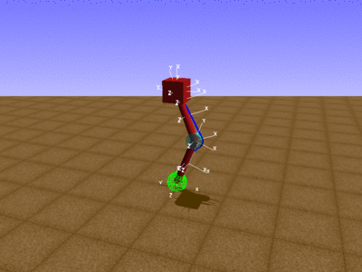
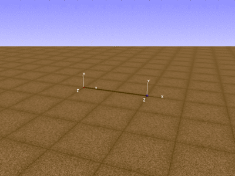
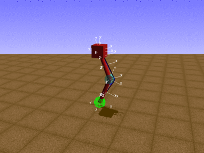

Example: *Hopper Device* 
========================

This example demonstrates some of the new features of the OpenSim 4.0 API.
The Component architecture allows us to join sub-assemblies to form larger Models, with information flowing between Components via Inputs, Outputs, and Connectors.
For more information, please refer to the [OpenSim doxygen](http://doxygen.opensim.community/) for the Component class.

This interactive example consists of three steps:

| | |
|-|-|
| **Step 1.** Build and simulate a single-legged hopping mechanism.      | 
| **Step 2.** Build an assistive device and test it on a simple testbed. | 
| **Step 3.** Connect the device to the hopper to increase hop height.   | 

There are five files in this project, three of which you will need to complete.
Here is a brief description of their contents:

| File                        | Contents
| :-------------------------- | :-------------------------------------------------------------------------
| buildHopperModel.cpp        | Builds an OpenSim model of a single-legged hopping mechanism.
| helperMethods.h             | Methods for running simulations, displaying the names of outputs, etc.
| defineDeviceAndController.h | (incomplete) Class definitions for an assistive device and its controller.
| buildDeviceModel.cpp        | (incomplete) Builds an OpenSim model of the assistive device.
| exampleHopperDevice.cpp     | (incomplete) Creates and connects models, runs simulations, etc.

To start working through this example, go to `main()` at the bottom of the "exampleHopperDevice.cpp" file.
From there, you will be directed to specific files and methods in this project that need to be completed.
Now, hop to it!
