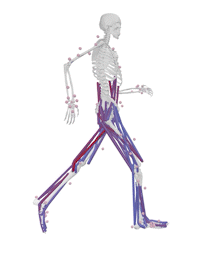

<!-- OpenSim Logo -->

    <a href="https://opensim.stanford.edu/">
        

<!-- Badges -->

    
    
    
    
    
    

---

**NOTE: This repository contains the source code of OpenSim 4.x. For OpenSim 3.x or earlier, see [this link](https://simtk-confluence.stanford.edu/display/OpenSim/Building+OpenSim+from+Source).**

OpenSim is software that lets users develop models of musculoskeletal structures and create dynamic simulations of movement, such as this one:

<!-- OpenSim Simulation -->

    

More information can be found at our websites:

* [OpenSim website](http://opensim.stanford.edu), in particular the [support page](http://opensim.stanford.edu/support/index.html).
* [SimTK project website](https://simtk.org/home/opensim).

This repository contains:

 - OpenSim's C++ libraries.
 - OpenSim's C++ examples.
 - OpenSim's command-line applications (inverse kinematics, computed muscle control, etc.).
 - OpenSim's Java and Python bindings.

This repository does *not* include source code for the OpenSim GUI. The source code for the Opensim GUI can be found [here](https://github.com/opensim-org/opensim-gui).

## Download and Setup

Depending on your needs, there are different ways of downloading and setting up OpenSim:

- **OpenSim GUI**
  - [Download page](https://simtk.org/frs/?group_id=91)
  - [Scripting in the GUI](https://simtk-confluence.stanford.edu/display/OpenSim/Scripting+in+the+GUI)
- **Matlab and Python Scripting**
  - [Setup Instructions](https://simtk-confluence.stanford.edu/display/OpenSim/Scripting)
- **Scripting in Conda**
  - [Conda Package](https://anaconda.org/opensim-org/opensim)
  - [Source Code](https://github.com/opensim-org/conda-opensim)
  - [More Info](https://simtk-confluence.stanford.edu/display/OpenSim/Conda+Package)
- **C++ Development**
  - [Build Instructions](https://github.com/opensim-org/opensim-core/wiki/Build-Instructions) for Windows, macOS, and Linux (Ubuntu and Debian).
  - [Developer's Guide](https://simtk-confluence.stanford.edu/display/OpenSim/Developer%27s+Guide)
  - [API Reference](https://simtk.org/api_docs/opensim/api_docs)
- **Looking for help?**
  - [Ask a question](https://simtk.org/plugins/phpBB/indexPhpbb.php?group_id=91&pluginname=phpBB)
  - [Submit an Issue](https://github.com/opensim-org/opensim-core/issues)

## Documentation

OpenSim's documentation can be found in our [Documentation](https://simtk-confluence.stanford.edu/display/OpenSim/Documentation) website.
OpenSim's C++ API reference can be found [here](https://simtk.org/api_docs/opensim/api_docs/).

A simple example of an elbow simulation in C++, Python and Matlab can be found in the [OpenSim API Example](https://github.com/opensim-org/opensim-core/wiki/OpenSim-API-Example) page of this repository's wiki.

Examples and Tutorials for OpenSim can be found in the [Examples and tutorials](https://simtk-confluence.stanford.edu/display/OpenSim/Examples+and+Tutorials) website. These tutorials move from introductory to more advanced, so you can learn OpenSim in a progressive way. Additional OpenSim-based tutorials, homework problems, and project ideas are available on the [Biomechanics of Movement classroom site](https://simtk-confluence-homeworks.stanford.edu/pages/viewpage.action?pageId=5537857).

## Releases 

This repository contains releases for OpenSim 4.x. You can find all of the OpenSim's releases in the [Releases](https://github.com/opensim-org/opensim-core/releases) page of this repository.

## Build instructions 

We provide scripts to build OpenSim on Windows, macOS and Linux (Ubuntu and Debian). The instructions to download and execute the scripts can be found in the [Build Instructions](https://github.com/opensim-org/opensim-core/wiki/Build-Instructions) page of this repository's wiki.

## Contribute 

There are many ways in which you can participate in this project. For example:

 - Report bugs and request features by submitting a [GitHub Issue](https://github.com/opensim-org/opensim-core/issues).
 - Ask and answer questions on our [Forum](https://simtk.org/plugins/phpBB/indexPhpbb.php?group_id=91&pluginname=phpBB).
 - Review and test new [Pull Requests](https://github.com/opensim-org/opensim-core/pulls).
 - Review the [Documentation](https://simtk-confluence.stanford.edu:8443/display/OpenSim/Documentation) and the [Wiki](https://github.com/opensim-org/opensim-core/wiki) by reporting typos, confusing explanations and adding/suggesting new content.
 - Fix bugs and contribute to OpenSim's source code by creating a [Pull Requests](https://github.com/opensim-org/opensim-core/pulls).

Please, read our [Developer's guide](https://simtk-confluence.stanford.edu:8443/display/OpenSim/Developer%27s+Guide), [Developer's Guidelines](https://github.com/opensim-org/opensim-core/blob/master/DEVELOPING.md) and our [Code of Conduct](https://github.com/opensim-org/opensim-core/blob/master/CODE_OF_CONDUCT.md) before making a pull request.

## License 

Licensed under the Apache License, Version 2.0.  See the full text of the [Apache License, Version 2.0](https://github.com/opensim-org/opensim-core/blob/master/LICENSE.txt) for more information. This license makes OpenSim suitable for commercial, government, academic, and personal use.

Third-party components have their own licenses. see our [Notice](https://github.com/opensim-org/opensim-core/blob/master/NOTICE), and [Acknowledgements](https://simtk-confluence.stanford.edu:8443/display/OpenSim/Acknowledgements) webpages for more information.

### How to acknowledge us

Acknowledging the OpenSim project helps us and helps you. It allows us to track our impact, which is essential for securing funding to improve the software and provide support to our users (you). If you use OpenSim, we would be extremely grateful if you acknowledge us by citing the following paper:

> Seth A, Hicks JL, Uchida TK, Habib A, Dembia CL, et al. (2018) **OpenSim: Simulating musculoskeletal dynamics and neuromuscular control to study human and animal movement.** _PLOS Computational Biology_ 14(7): e1006223. https://doi.org/10.1371/journal.pcbi.1006223

If you use plugins, models, or other components contributed by your fellow researchers, you must acknowledge their work as described in the license that accompanies each of these files.

## Funding

The OpenSim project is currently supported by the following:
 - United States National Institutes of Health (NIH)
    - [Mobilize Center](https://mobilize.stanford.edu/) (P41 EB027060)
    - [Restore Center](https://restore.stanford.edu/) (P2C HD101913)
 - [Wu Tsai Human Performance Alliance](https://humanperformancealliance.org/)

Past funding includes the following grants and contracts:

 - United States National Institutes of Health (NIH)
    - Simulation of Biological Structures (Simbios; U54 GM072970)
    - Simulation in Rehabilitation Research (NCSRR; R24 HD065690, P2C HD065690)
    - Mobilize Center (U54 EB020405)
 - United States Defense Advanced Research Projects Agency (DARPA)
    - Warrior Web (W911QX-12-C-0018)
