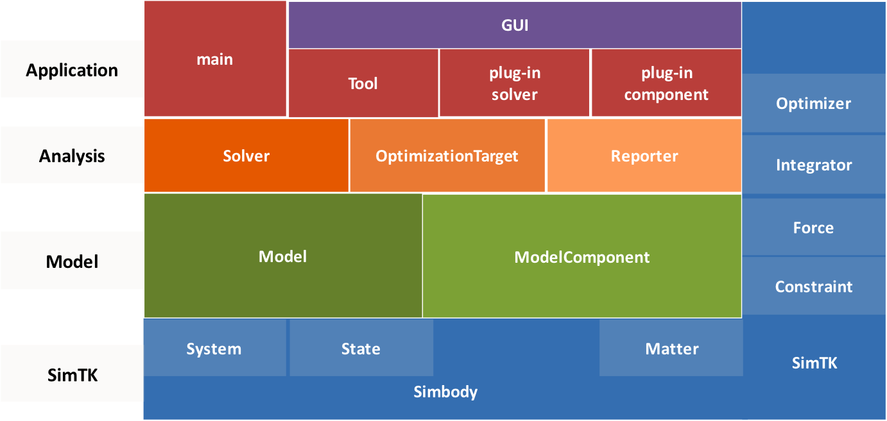
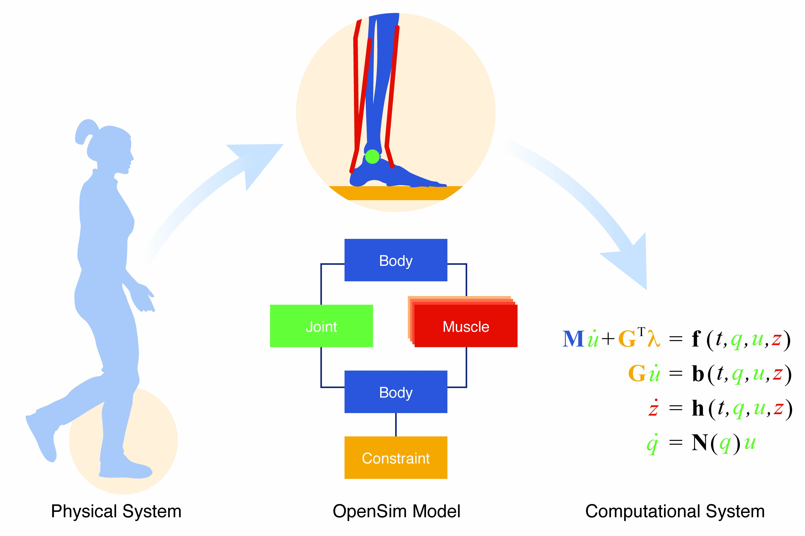
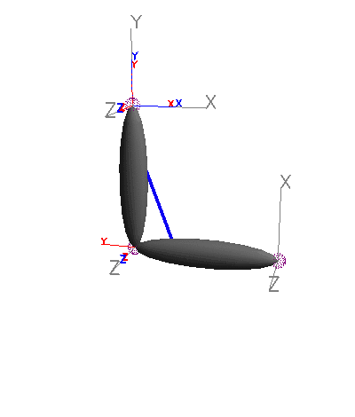
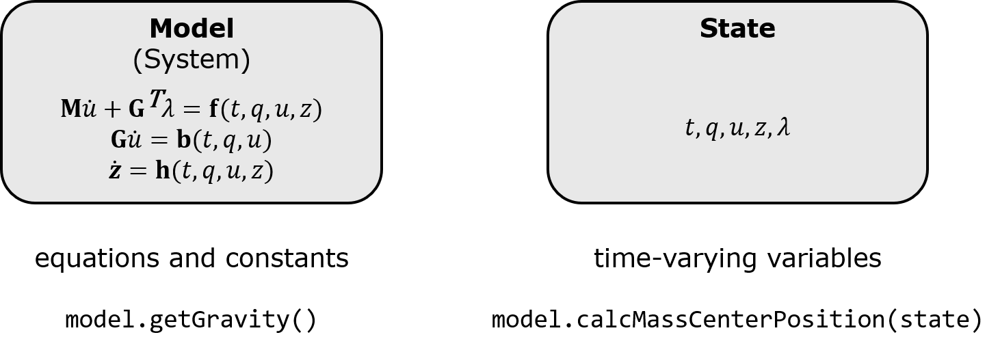
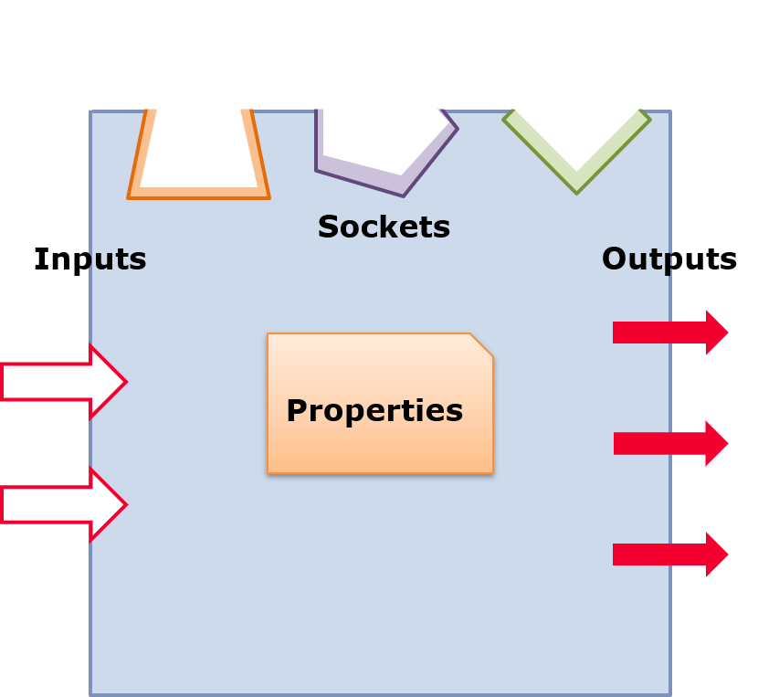
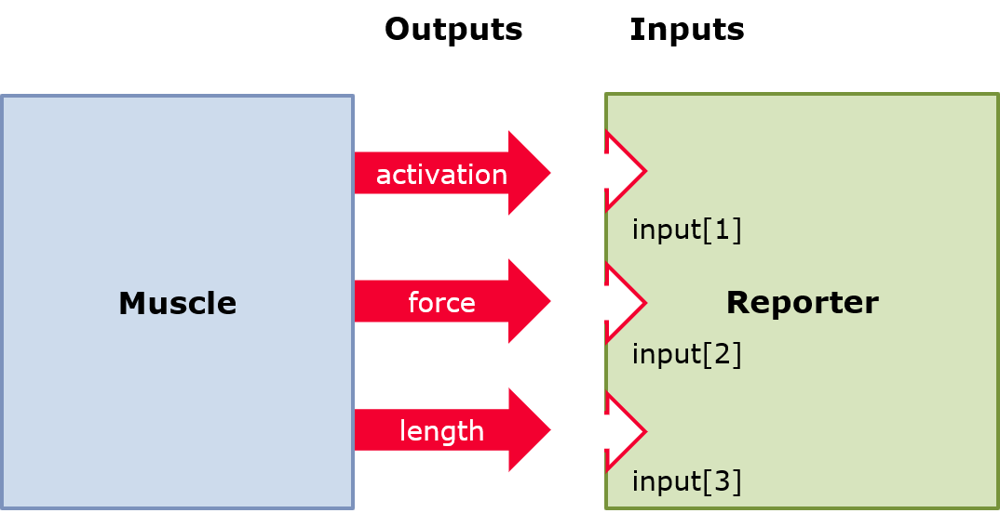
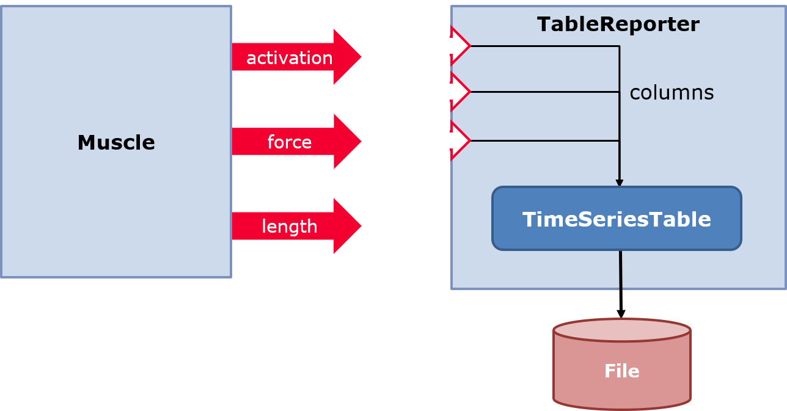
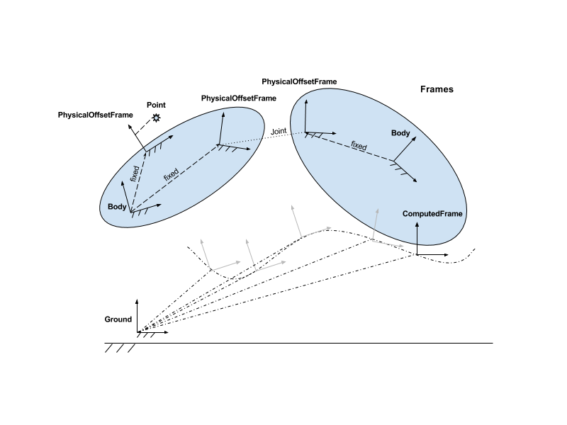

API Guide
=========
[TOC]

# Intended Audience {#intendedaudience}
This guide is recommended for those who desire in-depth knowledge of musculoskeletal modeling and simulation with %OpenSim and wish to use the Application Programming Interface (API) to create or contribute novel models or algorithms not currently supported by the OpenSim application. The guide also expects that you are familiar with multibody dynamics and biomechanics.

The OpenSim software has a variety of interfaces: GUI, command line, XML, Python scripting, MATLAB scripting, and C++. This guide is designed for developers using the last 3 of these interfaces. Programming experience in C++ will be helpful in understanding the API architecture, but we have tried to make this guide accessible to those with only Matlab or Python experience, as well.

# Overview of the OpenSim API for Developers {#overviewoftheapi}

## OpenSim’s Purpose {#opensimpurpose}
The purpose of OpenSim is to provide anyone interested in human or animal movement with high-performance software to create computer models of the neuromusculoskeletal system, analyze experimental movement data, and simulate movement dynamics to gain insights about the anatomy, physiology, mechanics and control of movement. The software is used in a variety of applications, including neuroscience research, biomechanical analysis, surgical design, and ergonomic analysis, and bioengineering education, just to name a few.  Our goal is to provide physically accurate models and tools that provide a solid foundation for scientific inquiry.

The OpenSim Application Programming Interface (OpenSim API) serves the OpenSim application, with its graphical user interface (GUI), and also enables advanced users and developers to write their own programs to extend the capabilities of OpenSim, including customized analyses and workflows, Components, and OpenSim plug-ins.

## Design Philosophy {#designphilosophy}
The ethos of the OpenSim API is that the code is modular, reusable, and easily extensible. To enable the assembly of neuromusculoskeletal systems from constituent biomechanical elements, OpenSim has adopted the [composite design pattern](https://en.wikipedia.org/wiki/Composite_pattern) to systematically define, organize, and manage the elements (components) of a neuromusculoskeletal system.

## Organization of OpenSim {#organization}

OpenSim is built on SimTK computational and simulation libraries that provide low-level, efficient math and matrix algebra libraries, such as LAPACK, as well as the infrastructure for defining a dynamic System and its State. One can think of the System as the set of differential equations, and the state as its variables. 

Empowering the computational layer is Simbody, an efficient multibody dynamics solver, which provides an extensible multibody System and State. The OpenSim modeling layer maps biomechanical structures (bones, muscles, tendons, etc.) into bodies and forces so that the dynamics of the System can be computed by Simbody. The Simbody Users Guide can be found [here](https://github.com/simbody/simbody/raw/master/Simbody/doc/SimbodyAndMolmodelUserGuide.pdf) and can help new users to understand the structure of OpenSim.

### The Three Interface Layers of OpenSim Built on SimTK

OpenSim (opensim-core) is essentially a set of libraries for building simple to complex musculoskeletal systems with complex actuators (e.g., muscles) and other forces (e.g., foot-ground contact), and enabling the motion (kinematics) of highly articulated bodies (bones). Torque, linear and physiological actuators such as muscles can be controlled by model controllers (e.g., Computed Muscle Control) to estimate the neural control and muscle forces required to reproduce human movement. An analysis layer is equipped with solvers and optimization algorithms for performing calculations with the model and to report results. At the highest level, these blocks are assembled into specialized applications (e.g., the `opensim-cmd` command-line application) to simulate and analyze model movement and internal dynamics. The OpenSim application is a Java-based program that calls Tools, Models, and underlying computations in SimTK via an interactive graphical user interface (GUI).

### A Composite Model Framework for Building a Computational System
In OpenSim, a Component is a computational model element that describes some physical phenomenon. As a neuromusculoskeletal simulator, OpenSim components represent bodies, joints, muscles, and other physical structures, as well as sensors, controllers, and feedback circuits that describe human and animal dynamics. The purpose of a Component is to both capture the physical phenomenon (degrees-of-freedom, constraints, actuation, control) of interest and to enable the systematic composition of complex behaviors (dynamical models) from simpler components.

To illustrate this point, think of two biomechanists, Gary Gait and Norma Knee. Gary is interested in the actions of individual muscles during gait and other forms of locomotion. Norma wants to understand how loads are distributed within the knee and their effect on cartilage wear and health. For Gary, a model represents a patient’s musculoskeletal dynamics and is capable of muscle-driven gait that reproduces human-like performance. In Norma’s case, a model consists of a femur, a tibia, a patella, contact between articulating surfaces, ligaments, and muscles, so that she can compute contact forces. Gary and Norma’s "models" may have similar complexity but their concepts of a model are fundamentally different (i.e., whole body vs. a knee). Gary may model knees as pin joints and attain reasonable answers about the action of leg muscles during different types of gait. Norma cannot justify the same simplification. A more accurate knee model may result in more realistic muscle forces for Gary, and simulated muscle forces (that reproduce human gait) may provide better boundary conditions for Norma’s estimates of knee loads. However, for these researchers to benefit directly from each other’s work, their models must be interoperable. In order for their models to talk to one another and be systematically combined, both models must have constructs in common. This modularity and interoperability is the main purpose of the Component API.

*Figure 1. Overview of the OpenSim Modeling Framework. Aspects of the musculoskeletal system (Physical System) such as bones, joints, and muscles, and its neurocontrol composed of spinal circuits, muscle spindle and Golgi tendon organs are represented as Components in the Modeling Framework. The specification of the types and arrangement of Components in a Model reflect the physical system being modeled and is the main task of the Modeler. From the assembly of Components (the Model) the corresponding computational System (system of equations readily solved by a computer) is automatically created and ready for numerical simulation and analysis. All System unknowns (variables) and their values are in the State.*

## A Simple Example {#simpleexample}

To get a taste of what the OpenSim API looks like, here is a complete example
of building and simulating a simple arm whose elbow is actuated by a muscle
(this example is in C++; you can find a Python version at
`Bindings/Python/examples/build_simple_arm_model.py`):

@snippet testREADME.cpp README

This code produces the following animation:

*Simple Arm Model. A two-body pendulum with single muscle actuator.*

and prints the following information to the console:
~~~
[reporter]
              |   /model_/bice|               |
          time| ps|fiber_force|    elbow_angle|
--------------| --------------| --------------|
  0.000000e+00| 1.18096897e+00| 1.57079633e+00|
1.00000000e+00| 5.72750904e+01| 7.70664118e-01|
2.00000000e+00| 1.97284113e+01| 1.56804557e+00|
3.00000000e+00| 5.60904315e+01| 1.44198608e+00|
4.00000000e+00| 3.45483498e+01| 1.50834805e+00|
5.00000000e+00| 3.26037208e+01| 1.51802366e+00|
6.00000000e+00| 3.71360518e+01| 1.50212351e+00|
7.00000000e+00| 3.56985024e+01| 1.50718884e+00|
8.00000000e+00| 3.41860103e+01| 1.50791862e+00|
9.00000000e+00| 3.43416494e+01| 1.50672695e+00|
1.00000000e+01| 3.57847134e+01| 1.50716396e+00|
~~~

## System and State {#systemstate}

A SimTK::System is the computational (mathematical) system of equations that represents the model dynamics, in a way that a computer can solve. In OpenSim, the model is formed by rigid bodies (e.g. bones) and connected by joints. A State is a set of values for all the unknowns (variables) of the System’s equations. The State contains all values necessary to fully evaluate the system of equations. The SimTK::State includes time and the generalized coordinates (Q; the joint angles and displacements) and the generalized speeds (U) of the multibody system. Any Component can add to the System (and State). For example, Muscles add their activation and fiber length variables to the State with their corresponding differential equations in the System. An OpenSim Model generates a System in order to perform calculations and solve for unknowns of interest to the modeler.

*Figure 2. An illustration of the difference between the model's System and a State object. Static model parameters (gravity, mass, inertia, muscle-tendon properties, etc.) are accessible directly via the Model, while methods that return state-dependent values (mass center position, muscle fiber velocity, etc.) require a State object argument.*

A [StatesTrajectory](@ref OpenSim::StatesTrajectory) is a sequence of States that satisfy the dynamical system of equations through time.

~~~~cpp
// Generate the System and State that implements the model (Namespace specification e.g. 'SimTK::' is needed only in C++)
SimTK::State state = model.initSystem();
int nq = state.getNQ();               // Number of generalized coordinates
SimTK::Vector q = state.getQ();       // Values of generalized coordinates
SimTK::Vector qdot = state.getQDot(); // Derivatives of generalized coordinates.
~~~~

Any method in OpenSim that performs a calculation that doesn’t simply depend on constants takes a SimTK::State object as the first argument.
~~~cpp
model.getMassCenter(state); // Need to know pose of model.
~~~

## Object {#object}

[Object](@ref OpenSim::Object) is the base class for all OpenSim Components, general containers like Set, and Tools that require serialization - that is having their attributes written out to file. Objects use Properties to serialize (write to file) and deserialize (read from file) their attributes, which are parameters and settings that define the behavior of the Object.

## Component {#component}
A [Component](@ref OpenSim::Component) is the basic "unit" of modelling and computing in OpenSim. It is our abstraction to capture a fundamental unit of computing and/or modeling used to compose a Model and form its computational system of equations. It is the base class that provides the supporting infrastructure for building up a hierarchically structured model with interconnections and numerous inputs and outputs, but is represented by a single computationally efficient (mathematical/numerical) system. That computational system is a SimTK::MultibodySystem and it is the computer implementation (think system of equations) of the multibody kinematics and dynamics plus any additional dynamics (ordinary differential equations, e.g. muscle activation dynamics) that need to be solved simultaneously. Any conceptual element that has to compute something typically requires the System and must be a Component in OpenSim. Component also provides the resources for reading and writing (also known as serializing, which it inherits from Object) the attributes/parameters that define the behavior of the component and adding in its dynamics (equations). The serializable attributes of a Component are called properties in OpenSim.

*Figure 3. Illustration of a generic component object, with property, input, output, and socket attributes.*

 A Component has the following defining attributes:
1. Properties: constant (time-invariant) parameters (e.g., a Body’s mass).
2. Sockets to other components that it depends on (e.g., a Joint connects two Frames).
3. Input quantities that the component needs to do its job (e.g., a metabolics calculator component could have a "muscle power" input).
4. Output quantities that component can compute, and that can be used to satisfy other components’ Inputs.
5. Subcomponents: A Component can rely on other components to do its job (e.g., a Muscle component can use subcomponents for activation and fiber-contraction dynamics). These are not user facing and are of interest only to the component writer.    

The common task for a Component (as part of a Model) is to make its contribution to the System (e.g. when Model::initSystem() if called). When the underlying System is built all the variables in the system equations appear in the State. As a unit of computation, the Component has the following computational attributes:

1. Continuous state variables (usually referred to as "state variables") are the variables in the dynamical equations contributed by the Component (e.g. activation and fiber-length state variables of a Muscle)
2. Discrete state variables are system unknowns that may or may not be governed by differential or algebraic equations, and include external inputs and controls. For example, when the actuation (force or tension that an actuator produces) of an Actuator is overridden, the override-actuation is a discrete state variable and must be supplied.
3. Cache variables allow saving of (state-dependent) calculations that may be used multiple times, to improve computational efficiency. For example, computing the path length of a muscle with several intermediate points and wrapping over obstacles is expensive. Therefore, a path component itself caches its length so that the muscle (or any other component) that needs the length in its computations does not reevaluate it unnecessarily. The validity of the path length cache variable is dependent on the generalized coordinates--as long as these generalized coordinates do not change, the path length is valid. OpenSim employs categories of dependency known as realization Stages (see Simbody User Guide, Section 2.4 for details) to manage the validity of cache variables. Any changes to the generalized coordinates invalidate (and wipe out) any cache variables associated with the Position Stage and all other subsequent (Velocity, Dynamics, Acceleration) stages. OpenSim automatically invalidates cache variables to support the correctness of simulations. Manual cache management is highly prone to errors leading to "stale" variables and potentially incorrect physics. Sadly, while results may appear plausible they are completely invalid and sometimes impossible to detect and debug. If you need to cache for performance, use OpenSim’s facilities.

### Models are composed of Components {#modelscomposed}
A Component encapsulates (all or part of the) system dynamics (of a model or element of a model) and provides (computes) values of interest. A component adds its dynamics and allocates necessary resources (state, cache, and other variables). It defines parameters (see Properties below) that specify its behavior/function and defines dependencies on any other Components (see Sockets below) via its Inputs and Outputs.

Components of a [Model](@ref OpenSim::Model) form a rooted directed tree topology of ownership (Components own and know about their subcomponents). Subcomponents of a component are the descendants in the tree. A root component (the top level Model) contains all the necessary Components to define the System. Components in the tree are uniquely identified by their full path name from the root (like a file path)

A branch in the ownership tree of a Model can be a complete subassembly representing a Device, a Leg or another FullBody Model.

This Component architecture means that:
- A Component can be composed of Components
- A Model is a Component
- A Model is composed of Components
- A Model can be composed of Models

You can add a subcomponent to another Component like so:
~~~cpp
CoordinateActuator* act = new CoordinateActuator();
act->setName("motor");
device.addComponent(act);
~~~

You can access existing subcomponents by name:
~~~cpp
// Get as abstract Component.
Component& c = device.updComponent("motor");

// Get as concrete Component.
auto& a = device.updComponent<CoordinateActuator>("motor");
~~~

You can also iterate through all subcomponents of a component, recursively (e.g., each subcomponent’s subcomponents):
~~~cpp
for (const auto& c : device.getComponentList()) {
    c.getFullPathName();
}

// Only iterate through Bodies
double totalMass = 0;
for (const Body& b : device.getComponentList<Body>()) {
    totalMass = totalMass + b.getMass();
}
~~~

### Property {#property}

A Property is a fixed parameter of the model that does not change as a simulation evolves over time (i.e., is not part of or dependent on the State). A Property is a serializable (as XML) container of common data types (e.g., doubles and strings) as well as Objects (e.g., Functions) and even other Components which include properties themselves. A serialized model is the XML counterpart of the Model and its Components (as Properties).

For each Property, there are several methods for accessing or modifying the value of the Property. For example, a Body’s mass property has the following related methods:
~~~cpp
double m = body.get_mass();
body.set_mass(3.5);
~~~
The properties available in any class are listed on Doxygen, the GUI (Help > XML Browser), and the command line tool (`opensim-cmd info Model`).

###Socket {#socket}

An @subpage OpenSim::Socket defines the dependency of a Component on another Component (the "connectee"). The type of the connectee must be specified (e.g., Body, Joint). The dependency is specified by the connectee’s relative or absolute path name.  A Socket finds and connects to the dependency when finalizeConnections() is called. The Socket provides the status of the connection (connected or not) and a reference to to the "connectee" when connected. All of a class’ Sockets are listed on the Doxygen page for that class.

You can query a Component for the number of Sockets it has, as well as for their names:
~~~cpp
int numConn = joint.getNumSockets();
auto connNames = joint.getSocketNames();
~~~

You can get a reference to a specific Socket of a Component using its name:
~~~cpp
AbstractSocket& parentSocket = joint.updSocket("parent_frame");
~~~

Once you have a Socket, you can see what types of Components it can be connected to, and if its connection is satisfied:
~~~cpp
parentSocket.getConnecteeTypeName(); // result: "PhysicalOffsetFrame"
bool satisfied = parentSocket.isConnected();
~~~

You can specify which Component the Socket should connect to. Here, we tell a Joint that its parent frame is Ground:
~~~cpp
parentSocket.connect(model.getGround());
~~~

Alternatively, Components with Sockets provide convenience `connectSocket_<name>()` methods for connecting them:
~~~cpp
joint.connectSocket_parent_frame(model.getGround());
~~~

To access the connectee itself, you can call the following method on the Component:
~~~cpp
auto ground = joint.getConnectee<PhysicalFrame>("parent_frame");
~~~

### Inputs and Outputs {#inputsoutputs}
Inputs and Outputs specify data flow. An Output is any Component "computed" value as a function of the state. An Output is used to pass results of computation from one Component to any other, provide fast access to Component calculations (same as a member function call), and collect results without needing to know the details of the source Component and/or its methods.

*Figure 4. Illustration of the relationship between outputs from one component to the inputs of another components. Here, the activation, force, and length outputs from Muscle object are wired to the inputs of a Reporter object, which then become easily accessible to the user after the simulation completes (see the "Reporter" section below).*

An [Input](@subpage OpenSim::Input) is a "slot" that accepts an Output of a specified type. The Input verifies that the Output can be evaluated/consumed as an Input. Inputs allow for a Component to have dependencies on Outputs (that can come from any Component or user-specified Data) rather than a specific Component type (as specified by a `Socket<C>`).

An [Output](@subpage OpenSim::Output) is a value of interest generated by a Component (e.g. Muscle has Outputs for its fiber-length and its tension). Outputs are accessed by name and evaluated given a State. Outputs are typed by their value type (e.g. `double`, `Vec3`, `SpatialVec`, `Vector`).

The Input provides its status as being connected (to an Output) or not. Thus, if an Input is connected to an Output, the Input triggers the evaluation of the Output by the Component to which the Output belongs. If an Output is not needed by any Input it is never evaluated.

1. Single Value Output: A single channel of data. Can be any data type (`Vec3`, `Mat33`, `double`, etc)
2. List Output: Multiple channels of data. Each channel must be of the same data type
3. Single Value Input: An input channel that reads one channel of data.
4. List Input: A list input that reads multiple channels of data of the same type

All of a class’s Inputs and Outputs are listed on the Doxygen page for the class.

You can access the number of inputs a Component has, as well as their names:
~~~cpp
int numIn = metabolics.getNumInputs();
auto names = metabolics.getInputNames();
~~~
Once you have their names, you can access a specific Input:
~~~cpp
AbstractInput& input = metabolics.updInput("activation");
~~~
You can ask a specific Input for its data type and whether or not it is connected:
~~~cpp
string type = input.getConnecteeTypeName(); // result: double
bool satisfied = input.isConnected();
~~~
You can connect an Input to an Output like so:
~~~cpp
input.connect(soleus.getOutput("activation"));
~~~
If an Input is connected to an Output, you can ask for its value:
~~~cpp
double a = metabolics.getInputValue<double>("activation");
~~~
There are similar methods for Outputs:
~~~cpp
int numOut = metabolics.getNumOutputs();
auto names = metabolics.getOutputNames();
AbstractOutput& output = metabolics.getOutput("heat_rate");
string type = output.getTypeName();
string value = output.getValueAsString();
double hr = metabolics.getOutputValue<double>("heat_rate");
~~~
List Outputs may have multiple Channels:
~~~cpp
bool isList = output.isListOutput();
~~~
If so, then you could connect individual Channels to an Input:
~~~cpp
input.connect(tablesource.getOutput("column").getChannel("col1"));
~~~
If you have a List Input, then you can wire it to multiple Channels (from both one-value and list Outputs):
~~~cpp
input.connect(tablesource.getOutput("column").getChannel("col1"));
input.connect(soleus.getOutput("activation"));
~~~
There are cases where an Input might need to "rename" an Output. For example, an InverseKinematics Solver could have a List Input for experimental marker locations, and could require its connectees to be named after markers in the Model. But say the experimental marker that corresponds to the Model’s "toe" marker is called "foot." One can "rename" an output using "annotations":
~~~cpp
input.connect(tablesource.getOutput("column").getChannel("foot"), "toe");
~~~

## Main Categories of Components
### Operator {#operator}

An Operator is used to describe a purely functional/mathematical Component. An Operator requires a set of one or more Inputs, it computes on them, and sends its results to a set of one or more Outputs. An Operator has no dependencies on other Components (i.e. Sockets) and does not require a Model to operate (just Inputs). Some examples are arithmetic operations (``+,-,*,/``), `max/min`, a `delay`, and `de/multiplexer`. They are useful for manipulating the Outputs of other Components, for example, to delay an Output or report its max or min value.  

Note: OpenSim does not yet contain any built-in Operator components.

### Source {#source}

A Source is a category of components that serves as a source of Outputs (signals) to satisfy model Inputs and that does not itself have any Inputs.

[TableSource](@ref OpenSim::TableSource) is one such Component which holds a `TimeSeriesTable` (see below) and exposes a List Output which contains a Channel for each column of the table.

### Reporter {#reporter}

A [Reporter](@ref OpenSim::Reporter) collects the results of Model computations. It can take any Outputs from a Model (and its Components) as its Inputs. Whether it reports to the terminal, file, or a port is dependent on the concrete Reporter type. Reporters are templated on the datatype of the reported Output<T> type (i.e., a single Reporter can only output one type of data, such as `double` or `Vec3`), but there is no limit to the number of Reporters a Model can have.

*Figure 5. Illustration of the Reporter class. As described previously, a Reporter uses inputs to accept quantities outputted from other components. Here, a TableReporter object accepts a Muscle object's quanities as inputs and internally store the data in a TimeSeriesTable. The data can then be accessed by outputting the data to a file (via a FileAdapter) or through the TimeSeriesTable directly.*

### ModelComponent {#modelcomponent}

A [ModelComponent](@ref OpenSim::ModelComponent) is the base type for all components that can be used to compose a Model. The most common types of ModelComponents are the following:

- [PhysicalFrame](@ref OpenSim::PhysicalFrame),
- [Joint](@ref OpenSim::Joint),
- [Constraint](@ref OpenSim::Constraint),
- [Force](@ref OpenSim::Force),
- [Actuator](@ref OpenSim::Actuator),
- [Controller](@ref OpenSim::Controller), and
- [Probe](@ref OpenSim::Probe).

OpenSim contains built-in model components for each type above, but users can
also create their own model components.

## Principal ModelComponents {#modelcomponents}

### Frames {#frames}

[Frame](@ref OpenSim::Frame) is an OpenSim representation of a reference frame in which the spatial location and orientation of other Frames can be described. Every Model has a [Ground](@ref OpenSim::Ground) frame in which all other Frames can be measured. A Frame consists of a right-handed set of three orthogonal axes and an origin point. Frames provide a convenient way to locate physical structures, such as joints and muscle attachments. Frames also provide a convenient basis for performing spatial calculations. For example, if your system includes contact, you might define a Frame that is aligned with the normal direction of a contact surface and whose origin is at the center-of-pressure. You can then easily report the contact forces normal to the contact surface and the location of the center-of-pressure, without repeatedly performing the transformations in your main or analysis code.

There are several types of Frames:

1. [PhysicalFrame](@ref OpenSim::PhysicalFrame): supports physical connections (e.g., Joints, Constraints) and is the Frame type to which forces can be applied. A concrete example of a PhysicalFrame is a Body. PhysicalFrame is an abstract class.
2. [Ground](@ref OpenSim::Ground): an inertial reference frame in which the motion of all Frames and Points may conveniently and efficiently be expressed. As a PhysicalFrame, Ground supports physical connections by joints, constraints and forces can be applied to it.
3. [Body](@ref OpenSim::Body): a PhysicalFrame with inertia. A Body is specified by its mass, a center-of-mass located in the PhysicalFrame, and its moment of inertia tensor about the center-of-mass.
4. [PhysicalOffsetFrame](@ref OpenSim::PhysicalOffsetFrame): a type of Physical Frame whose transform is specified as a constant offset from another Physical Frame. For example, PhysicalOffsetFrames can be used to specify the location and orientation of a Joint or Constraint on a Body.

The following diagram illustrates how each type of PhysicalFrame might appear in a model.

(Note: "ComputedFrame" does not yet exist in OpenSim, but you could create it yourself!)

Every Frame is capable of providing its Transform (translation of the origin and the orientation of its axes) in the Ground frame as a function of the State and provides convenience methods for re-expressing vectors from one Frame to another.

It is perhaps less evident that Frames can be extremely useful for linking a multitude of reference frames together to form chains and trees. For example, a Frame to specify muscle attachments (M) and a Frame to specify a joint location (J) could themselves be specified in an anatomical Frame (A) defined by bony landmarks identified by surface markers or tagged on CT or MRI images. The body (B), to which the anatomical frame (A) is attached, can be thought of as a "Base" frame or a root of a tree from which a set of descendant frames arise. In particular, a Base frame and all its descendants have the property that they share the same angular velocity, since they are affixed to the same underlying Frame (in this case a Body).

~~~~
        M---muscle points
       /
  B---A
       \
        J---joint axes
~~~~

Given this tree, both the muscle attachment points (in M) and the joint axes, J, change when the anatomical frame, A, changes with respect to the base, B, without requiring muscle attachments and joint axes to be manually adjusted. Consequently, a useful concept is that of a Base frame, and a Frame can always provide its Base frame. If a Frame is not affixed to another frame, its Base frame is itself.

### Points, Stations and Markers {#points}

A [Point](@ref OpenSim::Point) is an OpenSim representation of any location in space. Points can be used to define and compute the location of physical structures (such as points of constraints and points of muscle attachments). Points can also embody the results of spatial calculations. For example, if your system involves contact, you can define a Point that describes the location of the center-of-pressure as one element rolls over another.

A Point provides its location, velocity, and acceleration in the Ground frame as a function of the Model’s state, as long as the state has been realized to the appropriate stage (Position, Velocity, or Acceleration)

1. [Point](@ref OpenSim::Point): an abstraction for any location in space
2. [Station](@ref OpenSim::Station): a Point fixed to a PhysicalFrame
3. [Marker](@ref OpenSim::Marker): a Station that represents a motion capture marker from an experiment

OpenSim Stations are Points defined in Euclidian space. They are defined with a three element column vector (Vec3), relative to their parent Frame. Stations are thus analogous to PhysicalOffsetFrames in that constraints and forces can be attached and/or applied to them.

### Joints {#joints}
  - [Joint](@ref OpenSim::Joint)

### Constraints {#constraints}
  - [Constraint](@ref OpenSim::Constraint)

### Forces {#forces}
[Force](@ref OpenSim::Force)
- [PointToPointSpring](@ref OpenSim::PointToPointSpring)
- **ContactForces**
  - [HuntCrossleyForce](@ref OpenSim::HuntCrossleyForce)
  - [ElasticFoundationForce](@ref OpenSim::ElasticFoundationForce)

### Actuators {#actuators}
[Actuator](@ref OpenSim::Actuator)
- [CoordinateActuator](@ref OpenSim::CoordinateActuator)
- [Muscle](@ref OpenSim::Muscle)

### Controllers {#controller}
[Controller](@ref OpenSim::Controller)

## Data Handling Classes {#datahandling}
### Data Table
[DataTable](@ref OpenSim::DataTable) is an in-memory storage container for data with support for holding metadata. DataTables provide a single, unified method for storing and accessing data, such as results generated by Components. Reporter and Source components may use DataTables internally. They provide fast access to numerical elements and to complete rows and columns of data, by index and by column names. DataTables are independent of any particular file format.

DataTables contain a single "independent" column and a set of dependent columns. The independent column can be any scalar data type (e.g., `int`, `float`, `double`). The dependent columns can be of any data type (`double`, `Vec3`, `Mat33`, `SpatialVec`, etc.). All of the dependent columns must be of the same data type. Each independent and dependent column, as well as the entire table, can contain metadata.

### Data Adapter
[DataAdapter](@ref OpenSim::DataAdapter) is an abstract class that defines an interface for reading and writing the contents of a DataTable.

The DataAdapter separates use of a DataTable from the various sources of data, including streams, files, databases, and devices. A DataAdapter is how you read from or write to different sources of data. Concrete classes handle the particular interface and format of a given data source.

[FileAdapter](@ref OpenSim::FileAdapter) offers an interface to read and write files through the following methods.
~~~cpp
FileAdapter::read(string fileName)
FileAdapter::write(string fileName)
~~~

Based on the extension part of the filename, these methods invoke one of the following concrete FileAdapters to perform the read/write.

1. [TRCFileAdapter](@ref OpenSim::TRCFileAdapter): reads and writes TRC files.
2. [STOFileAdapter](@ref OpenSim::STOFileAdapter): reads and writes STO files.
3. [CSVFileAdapter](@ref OpenSim::CSVFileAdapter): reads and writes CSV files.
4. [C3DFileAdapter](@ref OpenSim::C3DFileAdapter): reads C3D files.

While it is possible to invoke the concrete FileAdapters above for reading data files, it is often more intuitive to think about what type of DataTable you want to read, rather than which Adapter class to use. Thus we provide constructors to create tables from files using the appropriate FileAdapters internally. For example, to read a TimeSeriesTableVec3 of marker data from a TRC file you can use:
~~~cpp
TimeSeriesTableVec3 markersTable("markerDataFile.trc"); 
TimeSeriesTable coordinates("kinematics.sto");
~~~

## Solvers {#solvers}

A Solver is an abstraction to capture an algorithm/process to compute System unknowns of a Model. For example, the [InverseKinematicsSolver](@ref OpenSim::InverseKinematicsSolver) operates on the System underlying a Model to determine the generalized coordinate (state variable) values that satisfy external measurements (Markers). The [MomentArmSolver](@ref OpenSim::MomentArmSolver) evaluates a muscle path to determine the effectiveness of a muscle to generate a generalized force about or along a coordinate.

The [Manager](@ref OpenSim::Manager) currently serves as a "ForwardDynamics" Solver which integrates the System dynamics forward in time.  We intend to provide a ForwardDynamicsSolver that returns a StatesTrajectory. In the meantime, you can generate a StatesTrajectory by implementing your own simulation function, like this:
~~~cpp
StatesTrajectory simulate(const Model& model, const State&
 initState,     double finalTime) {
    StatesTrajectory states;
    SimTK::RungeKuttaMersonIntegrator integrator(model.getSystem());
    SimTK::TimeStepper ts(model.getSystem(), integrator);
    ts.initialize(initState);
    ts.setReportAllSignificantStates(true);
    integrator.setReturnEveryInternalStep(true);
    while (ts.getState().getTime() < finalTime) {
        ts.stepTo(finalTime);
        // StatesTrajectory API for appending states:
        states.append(ts.getState());
    }
    return states;
}
~~~

# Writing your own Component {#writingcomponents}
The main task for Components (as part of a Model) is to generate a System. When the underlying System is built, all the variables in the system of equations appear in the State. A Component, therefore, is responsible for adding state variables to the system and providing access to those variables. The system can (and typically does) obtain default values for state variables from the Component’s properties.

#### The responsibility of the Component builder is four-fold:
  1. Construct the structural attributes of the component: its properties (serializable attributes), sockets (structural dependencies), inputs (signals it needs) and outputs (signals/values, results) that it will produce.
  2. Finalize data members that are dependent on your properties and add relevant checks to ensure your component is connected properly. With a Component finalized and connected, it is time to translate your Component into equations of the System and its variables into the corresponding State. Once a system is built, changes to any Component properties and connections will invalidate the System and the System must be rebuilt.
  3. Add the necessary multibody elements to the system, and any other dynamics described as a system of first order ODEs. This involves allocating and adding state variables and specifying their time derivatives.
  4. initialize the state variables allocated by your component, which generally involves using properties either to hold initial values or to compute them. The inverse operation of converting a state into properties for use another time is also helpful.

## I. Constructing your Component’s Attributes {#constructproperties}
  1. Derive your component from the base component type you want to extend. You may derive from that class or its parent. If your component is completely new, you can derive directly from Component or ModelComponent, but that is generally a bit more work, since the base classes for the different types do a lot of the hookups (that follow) for you.
  2. Construct your component with the properties (elements that appear in XML) you want. You must first define the properties you want to expose by calling one of the `OpenSim_DECLARE_PROPERTY` macros, which you use to specify the name, type and description of the property. NOTE: your class automatically has `get/set_<property_name>()` methods when you apply the macro, and the properties and corresponding methods are inherited from its parent class.
  ~~~cpp
  OpenSim_DECLARE_PROPERTY(gain, double, "Controller gain.");
  OpenSim_DECLARE_LIST_PROPERTY(functions, Function,
          "Functions are used to compute the force applied to bodies.");
  ~~~        

  3. Invoke the individual `constructProperty_<property_name>()` methods  for each property you have declared and assign them default values in each constructor. If you have multiple properties and constructors it is convenient to create a function `void constructProperties()` as a private method that can be called from each constructor.
  ~~~cpp
  public:
      MyController() { constructProperties(); }
  private:
      void constructProperties() {
          constructProperty_gain(10);
          constructProperty_functions();
      }
  ~~~
  4. If you have dependencies on other components  you should specify those dependencies by using the `OpenSim_DECLARE_SOCKET` macro with the Socket name and type of the dependency. For example, a Joint has two sockets of type PhysicalFrame and their names are *parent_frame* and *child_frame* respectively. Sockets automatically generate properties with socket type and name as part of the XML tag.  The expected XML value is the full path name of the dependency component. OpenSim can now check the existence of the dependency, and ensure it is of the correct type. If the dependency is not satisfied, OpenSim will provide meaningful error messages.
  ~~~cpp
  OpenSim_DECLARE_SOCKET(muscle, Muscle,
          "The muscle for which to compute metabolic rate.");
  ~~~
  5. Specify your component’s Outputs by employing the `OpenSim_DECLARE_OUTPUT` macro with the name of the output, its value type, and the member function of your component that produces the value of the output. Similarly, use the `OpenSim_DECLARE_INPUT` macro to create a named slot for the Output of another component to plug in.
  ~~~cpp
  OpenSim_DECLARE_INPUT(desired_angle, double, SimTK::Stage::Position,
          "This controller will try to minimize the error from this angle (radians).");

  OpenSim_DECLARE_OUTPUT(heat_rate, double, SimTK::Stage::Dynamics,
          calcHeatRate);
  ~~~

## II. Finalize Properties and Connections of the Component {#finalizefromproperties}
All components are given the opportunity finalize their specification from their properties, which occurs during `OpenSim::Component::finalizeFromProperties()`. The base (Component) implementation also makes sure Components that are properties (e.g. a BodySet, JointSet) are included as subcomponents. As subcomponents, any actions invoked on the top-level component invokes its subcomponents, automatically. For example, `finalizeFromProperties()` is invoked on the subcomponents. To add custom functionality to your Component:

  1. Override `OpenSim::Component::extendFinalizeFromProperties()` to perform any data loading or conversions that the Component will need during a simulation. For example, the Body component has a property that contains six numbers intended to be the moments and products of inertia of a physical body.  Body overrides  `extendFinalizeFromProperties()` to convert those 6 numbers to a proper SimTK::Inertia, which will throw pertinent exceptions about  the validity of those numbers to form a physical inertia tensor. Note, that the base `Component::finalizeFromProperties()` marks the component as being up-to-date with its properties.  We indicate virtual methods intended for Component writers to extend the basic operations of a Component by using "extend" in the virtual function name.
  ~~~cpp
  void extendFinalizeFromProperties() {
      Super::extendFinalizeFromProperties();
      if (get_default_activation() < 0)
          throw Exception("Negative default activation.");
  }
  ~~~

  2. Similarly, Sockets are handled automatically by the base Component, which establishes that the dependency exists and is connected (throws an Exception otherwise).  Additional connection details or checks are often necessary, in which case you must override:
  ~~~cpp
  void OpenSim::Component::extendFinalizeConnections(Component& root)
  ~~~
     for a Component, or
  ~~~cpp
  void OpenSim::ModelComponent::extendConnectToModel(Model& model)
  ~~~
     for a ModelComponent. Here you can verify that the components that satisfy its sockets also satisfy other conditions: for example, that the connectees are unique (e.g. a Joint requires parent and child to not be the same PhysicalFrame). Inputs are automatically connected based on the Output name.   However, if you know the output you need (e.g. a Muscle for a MetabolicCalculator), you can directly form the Input connection like this:
  ~~~cpp
  getInput("fiber_vel").connect(muscle.getOutput("fiber_velocity"));
  ~~~

## III. Adding your Component’s Dynamics to the System {#addtosystem}
  1. Override `void OpenSim::Component::extendAddToSystem(SimTK::MultibodySystem& system) const` and add Simbody elements to the System. It is important to note that you must maintain the underlying indices so your component can access the Simbody elements later if necessary. Classes like Joint, Constraint, and Force provide methods to help you create new types of these Components and manage the indices for you. Ask for help if you want to expose state variables allocated by underlying Simbody elements.
  2. If you have component dynamics that you will model as ordinary differential equations (ODEs) you must also add the corresponding state variable(s) to the system’s state also in `extendAddToSystem()` by invoking `addStateVariable()`.  If you can express your component dynamics as a function of the state: *zdot = F(state)*, then z is the state variable added by your component.
  3. The function (e.g. *F(state)* above) that determines the time derivative of your state must be implemented in `void OpenSim::Component::computeStateVariableDerivatives(const SimTK::State& s) const`, which you override.
  4. NOTE: Any value that your dynamics depends on that isn’t a constant must itself be a state variable or an Input. If the values are provided externally (e.g. user-supplied) the values must be held as discrete state variables and they are similarly allocated by `OpenSim::Component::addDiscreteVariable()` and must be set before the dynamics of the Component are realized.
  ~~~cpp
  void extendAddToSystem(SimTK::MultibodySystem& sys) const override {
      Super::extendAddToSystem(sys);        
      addStateVariable("activation"); addCacheVariable("fiber_force");
  }

  void computeStateVariableDerivatives(const SimTK::State& s) const override {
      Super::computeStateVariableValueDerivatives(s);
      setStateVariableDerivativeValue(s, "activation", ...);                    
  }
  ~~~

## IV. Initializing and Recalling the State {#initstatefromproperties}
1. It is good practice to initialize your component’s state variables, so that the component and the Model as a whole can simulate without user input. For example, Coordinates maintain "default_value" and "default_speed" properties for this purpose. The translation from properties to state variable values is implemented by `void OpenSim::Component::extendInitStateFromProperties(SimTK::State& state) const`, which you can override to initialize all the component's state variables from properties.
  ~~~cpp
  void extendInitStateFromProperties(SimTK::State& s) const override {
      Super::extendInitStateFromProperties(s);
      setStateVariableValue(s, "activation", get_default_activation());
  }
  ~~~
2. Overriding `void OpenSim::Component::extendSetPropertiesFromState(const SimTK::State& state)` enables you to perform the inverse operation and to update the property (e.g., the default_value) from the value in the State, for instance after a forward simulation. Ideally, your component should enable a simulation to be stopped, the state values held as properties, the model saved, then reloaded, initialized from its properties and the simulation resumed, such that concatenation of the two simulations is identical to performing a single simulation of longer duration.
  ~~~cpp
  void extendSetPropertiesFromState(const SimTK::State& s) const override {
      Super::extendSetPropertiesFromState(s);
      set_default_activation(getStateVariableValue(s, "activation"));        
  }
  ~~~

## Test Components {#testComponents}
While testing the dynamics of your Component and its results is best left to you, the Component builder, OpenSim provides a test harness for testing the structure and integrity of your Component. The test program in testComponents.cpp instantiates and performs some standard checks on each Component in its queue, to which you can add your Component, to test:
  1. serialization and deserialization and their equivalence
  2. cloning (copying) with its equivalence to the original
  3. memory increases due to copying
  4. adding the component to a Model
  5. the use of Sockets to define and satisfy dependencies
  6. initializing the System (calling `OpenSim::Model::initSystem()`) and its impact on memory
  7. evaluating Outputs at the Stage indicated by the Output.
