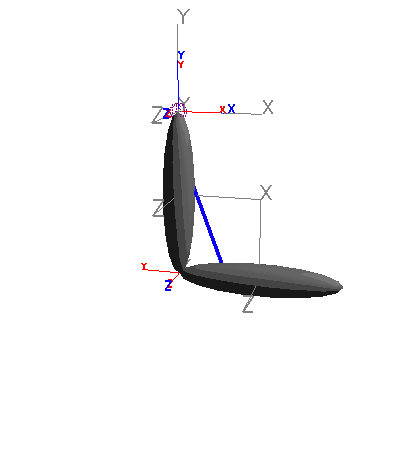

Simple example {#simplearmexample}
==============
Let's simulate a simple arm whose elbow is actuated by a muscle, using
the C++ interface (You can find a Python version of this example at
`Bindings/Python/examples/build_simple_arm_model.py`):

~~~cpp
#include <OpenSim/OpenSim.h>
using namespace SimTK;
using namespace OpenSim;

int main() {
    Model model;
    model.setName("bicep_curl");
    model.setUseVisualizer(true);

    // Create two links, each with a mass of 1 kg, center of mass at the body's
    // origin, and moments and products of inertia of zero.
    OpenSim::Body* humerus = new OpenSim::Body("humerus", 1, Vec3(0), Inertia(0));
    OpenSim::Body* radius  = new OpenSim::Body("radius",  1, Vec3(0), Inertia(0));

    // Connect the bodies with pin joints. Assume each body is 1 m long.
    PinJoint* shoulder = new PinJoint("shoulder",
            // Parent body, location in parent, orientation in parent.
            model.getGround(), Vec3(0), Vec3(0),
            // Child body, location in child, orientation in child.
            *humerus, Vec3(0, 1, 0), Vec3(0));
    PinJoint* elbow = new PinJoint("elbow",
            *humerus, Vec3(0), Vec3(0), *radius, Vec3(0, 1, 0), Vec3(0));

    // Add a muscle that flexes the elbow.
    Millard2012EquilibriumMuscle* biceps = new
        Millard2012EquilibriumMuscle("biceps", 200, 0.6, 0.55, 0);
    biceps->addNewPathPoint("origin",    *humerus, Vec3(0, 0.8, 0));
    biceps->addNewPathPoint("insertion", *radius,  Vec3(0, 0.7, 0));

    // Add a controller that specifies the excitation of the muscle.
    PrescribedController* brain = new PrescribedController();
    brain->addActuator(*biceps);
    // Muscle excitation is 0.3 for the first 0.5 seconds, then increases to 1.
    brain->prescribeControlForActuator("biceps",
            new StepFunction(0.5, 3, 0.3, 1));

    // Add components to the model.
    model.addBody(humerus);    model.addBody(radius);
    model.addJoint(shoulder);  model.addJoint(elbow);
    model.addForce(biceps);
    model.addController(brain);

    // Add a console reporter to print the muscle fiber force and elbow angle.
    ConsoleReporter* reporter = new ConsoleReporter();
    reporter->set_report_time_interval(1.0);
    reporter->addToReport(biceps->getOutput("fiber_force"));
    reporter->addToReport(
        elbow->getCoordinate(PinJoint::Coord::RotationZ).getOutput("value"),
        "elbow_angle");
    model.addComponent(reporter);

    // Add display geometry.
    Ellipsoid bodyGeometry(0.1, 0.5, 0.1);
    bodyGeometry.setColor(Gray);
    // Attach an ellipsoid to a frame located at the center of each body.
    PhysicalOffsetFrame* humerusCenter = new PhysicalOffsetFrame(
        "humerusCenter", "humerus", Transform(Vec3(0, 0.5, 0)));
    humerus->addComponent(humerusCenter);
    humerusCenter->attachGeometry(bodyGeometry.clone());
    PhysicalOffsetFrame* radiusCenter = new PhysicalOffsetFrame(
        "radiusCenter", "radius", Transform(Vec3(0, 0.5, 0)));
    radius->addComponent(radiusCenter);
    radiusCenter->attachGeometry(bodyGeometry.clone());

    // Configure the model.
    State& state = model.initSystem();
    // Fix the shoulder at its default angle and begin with the elbow flexed.
    shoulder->getCoordinate().setLocked(state, true);
    elbow->getCoordinate().setValue(state, 0.5 * Pi);
    model.equilibrateMuscles(state);

    // Configure the visualizer.
    model.updMatterSubsystem().setShowDefaultGeometry(true);
    Visualizer& viz = model.updVisualizer().updSimbodyVisualizer();
    viz.setBackgroundType(viz.SolidColor);
    viz.setBackgroundColor(White);

    // Simulate.
    simulate(model, state, 10.0);

    return 0;
};
~~~

This code produces the following animation:

*Simple Arm Model. A two-body pendulum with single muscle actuator.*

and prints the following information to the console:
~~~
[reporter]
              |   /model_/bice|               |
          time| ps|fiber_force|    elbow_angle|
--------------| --------------| --------------|
  0.000000e+00| 1.18096897e+00| 1.57079633e+00|
1.00000000e+00| 5.72750904e+01| 7.70664118e-01|
2.00000000e+00| 1.97284113e+01| 1.56804557e+00|
3.00000000e+00| 5.60904315e+01| 1.44198608e+00|
4.00000000e+00| 3.45483498e+01| 1.50834805e+00|
5.00000000e+00| 3.26037208e+01| 1.51802366e+00|
6.00000000e+00| 3.71360518e+01| 1.50212351e+00|
7.00000000e+00| 3.56985024e+01| 1.50718884e+00|
8.00000000e+00| 3.41860103e+01| 1.50791862e+00|
9.00000000e+00| 3.43416494e+01| 1.50672695e+00|
1.00000000e+01| 3.57847134e+01| 1.50716396e+00|
~~~
